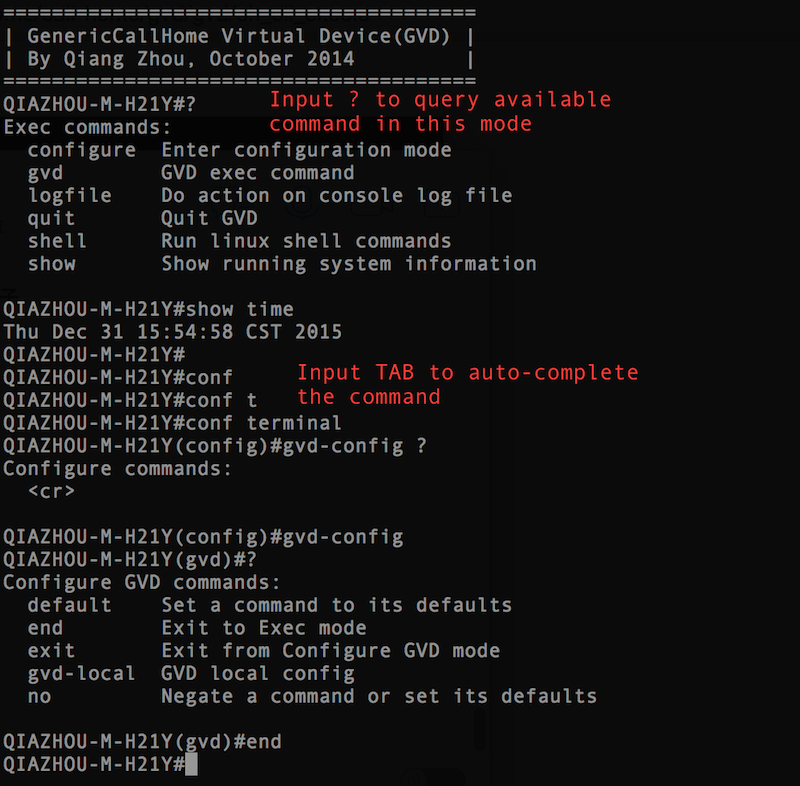

# Generic Virtual Device(GVD)

## Introduction

GVD is designed as a test tool, with a command-line UI. The command-line inside works in a cisco-like-shell fashion. Also it's easy to add/remove commands from GVD.

Here is a screenshot for GVD.

## How to run GVD

- Only support Mac OS X and Linux
- Run "python build.py" to generate the Makefile
- Run "make" to build GVD
- Run "build/gvd" to start GVD

## How to expand the CLI

Check file gvd_cli_example_tree.c, gvd_cli_example_tree.h, gvd_cli_example.h. Examples of adding commands in various submode are presented there.